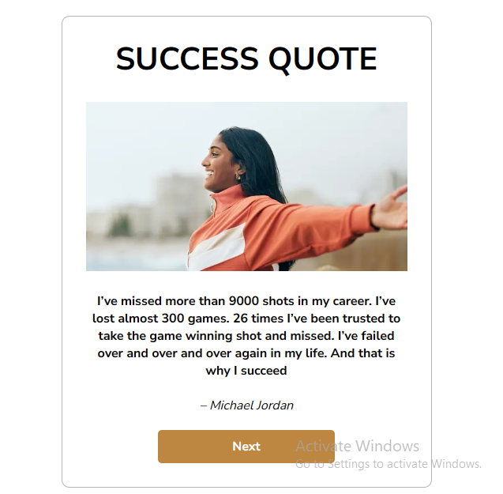

# Queen Koders Assignment One

## Task

- This is a simple project done as a team which involves creating ten different pages containing quotes and their images and linking one page to another.

## Description

- We collaborated on this project by:

 - Dividing the pages by the number of people in the group

 - Each member created a branch off of the main branch and worked on their part

 - Each member pushed to their branch

 - A member merged the branches together in the main branch

 - We adjusted the code to make sure everything worked fine.

 - And voila! We have a great project worked on by Queen Koders!!!

 ## Guideline to view the project

 To view the project on your local machine.
 - Clone the repository 

 ``git clone https://github.com/Perpy-del/queen-koders-one.git``

 - Change your current working directory to the project directory

 ``cd queen-koders-one``

 - Open the index.html file and run it on your local machine

 ## Contributors include
 - [Tosin Bamidele](https://github.com/TosinMary) 
 - [Chizaram Anisimuo](https://github.com/thezaram)
 - Sylvia Nnoruka
 - Blessing Peter
 - Stella Ugoo-Okonkwo
 - Wokrit Bakkuk
 - [Perpetual Meninwa](https://github.com/Perpy-del)
 - Chioma Ekpemerechi
 - [Udoka Kasie](https://github.com/UdokaSuccess)
 - Adejumoke Ajayi 

 ## Screenshot of the project

